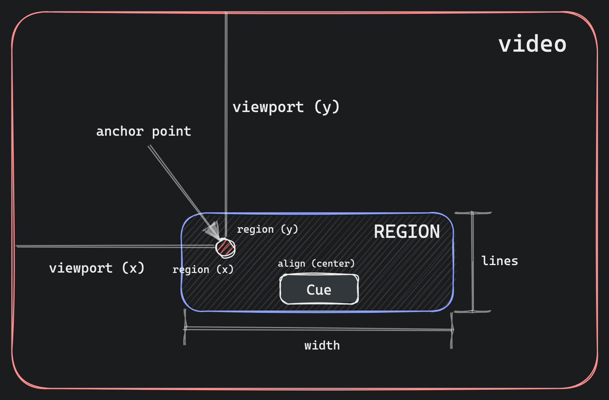
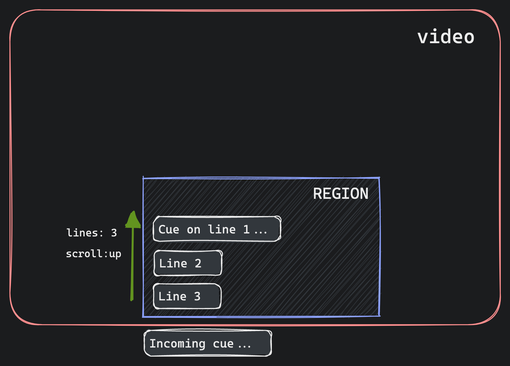
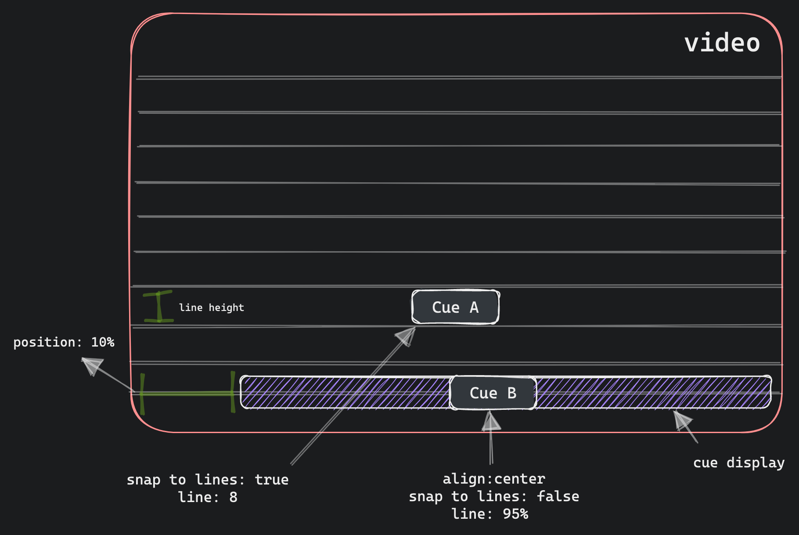

# Media Captions

[![package-badge]][package]
[![discord-badge]][discord]

Captions parsing and rendering library built for the modern web.

**Features**

- 🚯 0 dependencies.
- 💪 Built with TypeScript (TS 5 bundle mode ready).
- 🪶 5kB total + modular (parser/renderer split) + tree-shaking support.
- 💤 Parsers are lazy loaded on-demand.
- 🚄 Efficiently load and apply styles in parallel via CSS files.
- 🗂️ Supports VTT, SRT, and SSA/ASS.
- ⬆️ Roll-up captions via VTT regions.
- 🧰 Modern `fetch` and `ReadableStream` APIs.
- 📡 Chunked text and response streaming support.
- 📝 WebVTT spec-compliant settings and rendering.
- 🎤 Timed text-tracks for karaoke-style captions.
- 🛠️ Supports custom captions parser and cue renderer.
- 💥 Collision detection to avoid overlapping or out-of-bounds cues.
- 🏗️ Fixed and in-order cue rendering (including on font or overlay size changes).
- 🛑 Adjustable parsing error-tolerance with strict and non-strict modes.
- 🖥️ Works in the browser and server-side (string renderer).
- 🎨 Easy customization via CSS.

➕ Planning to also add a TTML, CEA-608, and CEA-708 parser that will map to VTT and render
correctly. In addition, custom font loading and text codes support is planned for SSA/ASS captions.
We don't have an exact date but most likely after the [Vidstack Player][vidstack-player] 1.0. If
urgent and you're willing to sponsor, feel free to email me at rahim.alwer@gmail.com.

🔗 **Quicklinks**

- **[Installation](#installation)**
- **[Demo](#demo)**
- **[Motivation](#motivation)**
- **[API](#api)**

## Demo

The StackBlitz link below showcases a simple example of how captions are fetched, parsed, and
rendered over a native video element. We plan on adding more examples for additional captions
formats and scenarios.

[][stackblitz-demo]

## Motivation

❓ **Are native captions not good enough?**

Simply put, no.

- Positioning, styling, and rendering of cues is interpreted differently across browsers (i.e.,
  not consistent).
- Styling customization via pseudo `::cue` selector is inconsistent across browsers and severely
  limited with respect to even basic movement and styles.
- Cues can not be easily or accurately moved which means they'll become hidden when custom controls
  are active.
- Multiple active cues are not rendered in the correct order. This can also occur randomly on font
  and overlay size changes (e.g., entering fullscreen).
- Failure in positioning and customizing styles correctly results in failing accessibility
  guidelines.
- Text tracks cannot be removed in most browsers as there's no native API to do so. Captions need
  to be managed externally and mapped to a generic text track.
- Karaoke-style captions are not supported out of the box in most browsers.
- Only VTT is natively supported by browsers.
- VTT Regions and roll-up captions are not fully supported in all browsers.
- Custom rendering of cues is not supported.
- Large caption files can not be streamed and aborted when no longer required.
- Obviously can not be used server-side.

Did you know closed-captions are governed by the Federal Communications Commission (FCC) under the
Communications and Video Accessibility Act (CVA)? Not providing captions and adequate
customization options on the web for content that was shown on TV doesn't meet guidelines 😱 Filed
law suits have dramatically increased in recent years! See the amazing
[Caption Me If You Can][caption-me-talk] talk at [Demuxed][demuxed] by Dan Sparacio to learn more.

❓ **What about [mozilla/vtt][mozilla-vtt]?**

The library is old, outdated, and unmaintained.

- Not packaged correctly by modern standards using Node exports with ES6, TS types, CJS/ESM,
  and server bundles.
- Doesn't lazy load the parser.
- Doesn't cleanly work server-side out of the box.
- Doesn't split parser and renderer so they can be imported separately when needed.
- Not built with TypeScript so no types are shipped.
- Doesn't support a wide variety features that we support. Including streaming via modern APIs,
  VTT regions, roll-up captions, custom renderers, alternative captions formats (SRT/SSA),
  timed-text and more.
- In-lines all styles which means they can't be loaded in parallel with JS, makes it harder to
  customize, and slower with respect to DOM updates.
- Doesn't include flexible error tolerance settings.
- Doesn't expose styling attrs for selecting nodes such as cues, voice nodes, and timed-text nodes.

## Installation

First, install the NPM package:

```bash
npm i media-captions
```

Next, include styles if you plan on rendering captions using the [`CaptionsRenderer`](#captionsrenderer):

```js
import 'media-captions/styles/captions.css';
// Optional - include if rendering VTT regions.
import 'media-captions/styles/regions.css';
```

Optionally, you can load the styles directly from a CDN using [JSDelivr](https://www.jsdelivr.com)
like so:

```html
<link rel="stylesheet" href="https://cdn.jsdelivr.net/npm/media-captions/styles/captions.min.css" />
<!-- Optional - include if rendering VTT regions. -->
<link rel="stylesheet" href="https://cdn.jsdelivr.net/npm/media-captions/styles/regions.min.css" />
```

## API

- **Parsing**
  - [Parse Options](#parse-options)
  - [Parse Result](#parse-result)
  - [Parse Errors](#parse-errors)
  - [`parseText`](#parsetext)
  - [`parseTextStream`](#parsetextstream)
  - [`parseResponse`](#parseresponse)
  - [`parseByteStream`](#parsebytestream)
  - [`CaptionsParser`](#captionsparser)
- **Rendering**
  - [`createVTTCueTemplate`](#createvttcuetemplate)
  - [`renderVTTCueString`](#rendervttcuestring)
  - [`tokenizeVTTCue`](#tokenizevttcue)
  - [`renderVTTTokensString`](#rendervtttokensstring)
  - [`updateTimedVTTCueNodes`](#updatetimedvttcuenodes)
  - [`CaptionsRenderer`](#captionsrenderer)
  - [Styling](#styling)
- **Formats**
  - [VTT](#vtt)
  - [SRT](#srt)
  - [SSA/ASS](#ssaass)
- [Streaming](#streaming)
- [Types](#types)

## Parse Options

All parsing functions exported from this package accept the following options:

- `strict`: Whether strict mode is enabled. In strict mode parsing errors will throw and cancel
  the parsing process.
- `errors`: Whether errors should be collected and reported in the final
  [parser result](#parse-result). By default, this value will be true in dev mode or if `strict`
  mode is true. If set to true and `strict` mode is false, the `onError` callback will be invoked.
  Do note, setting this to true will dynamically load error builders which will slightly increase
  bundle size (~1kB).
- `type`: The type of the captions file format so the correct parser is loaded. Options
  include `vtt`, `srt`, `ssa`, `ass`, or a custom [`CaptionsParser`](#captionsparser) object.
- `onHeaderMetadata`: Callback that is invoked when the metadata from the header block has been
  parsed.
- `onCue`: Invoked when parsing a VTT cue block has finished parsing and a `VTTCue` has
  been created. Do note, regardless of which captions file format is provided a `VTTCue` will
  be created.
- `onRegion`: Invoked when parsing a VTT region block has finished and a `VTTRegion` has been
  created.
- `onError`: Invoked when a loading or parser error is encountered. Do note, this is only invoked
  in development, if the `strict` parsing option is true, or if the `errors` parsing option is
  true.

Options can be provided to any parsing function like so:

```ts
import { parseText } from 'media-captions';

parseText('...', {
  strict: false,
  type: 'vtt',
  onCue(cue) {
    // ...
  },
  onError(error) {
    // ...
  },
});
```

## Parse Result

All parsing functions exported from this package return a `Promise` which will resolve a
`ParsedCaptionsResult` object with the following properties:

- `metadata`: An object containing all metadata that was parsed from the header block.
- `regions`: An array containing `VTTRegion` objects that were parsed and created during the
  parsing process.
- `cues`: An array containing `VTTCue` objects that were parsed and created during the parsing
  process.
- `errors`: An array containing `ParseError` objects. Do note, errors will only be collected if
  in development mode, if `strict` parsing option is set to true, or the `errors` parsing option is
  set to true.

```ts
import { parseText } from 'media-captions';

// `ParsedCaptionsResult`
const { metadata, regions, cues, errors } = await parseText('...');

for (const cue of cues) {
  // ...
}
```

## Parse Errors

By default, parsing is error tolerant and will always try to recover. You can set strict mode
to ensure errors are not tolerated and are instead thrown. The text stream and parsing process
will also be cancelled.

```ts
import { parseText, type ParseError } from 'media-captions';

try {
  // Any error will now throw and cancel parsing.
  await parseText('...', { strict: true });
} catch (error: ParseError) {
  console.log(error.code, error.message, error.line);
}
```

A more tolerant error collection option is to set the `errors` parsing option to true. This
will ensure the `onError` callback is invoked and also errors are reported in the final
result (this will add ~1kB to the bundle size):

```ts
import { parseText } from 'media-captions';

const { errors } = await parseText('...', {
  errors: true, // Not required if you only want errors in dev mode.
  onError(error) {
    error; // `ParseError`
  },
});

for (const error of errors) {
  // ...
}
```

The `ParseError` contains a numeric error `code` that matches the following values:

```ts
const ParseErrorCode = {
  LoadFail: 0,
  BadSignature: 1,
  BadTimestamp: 2,
  BadSettingValue: 3,
  BadFormat: 4,
  UnknownSetting: 5,
};
```

The `ParseErrorCode` object can be imported from the package.

## `parseText`

This function accepts a text string as input to be parsed:

```ts
import { parseText } from 'media-captions';

const { cues } = await parseText('...');
```

## `parseTextStream`

This function accepts a text stream [`ReadableStream<string>`](https://developer.mozilla.org/en-US/docs/Web/API/ReadableStream) as input to be parsed:

```ts
import { parseTextStream } from 'media-captions';

const stream = new ReadableStream<string>({
  start(controller) {
    controller.enqueue('...');
    controller.enqueue('...');
    controller.enqueue('...');
    // ...
    controller.close();
  },
});

// `ParsedCaptionsResult`
const result = await parseTextStream(stream, {
  onCue(cue) {
    // ...
  },
});
```

## `parseResponse`

The `parseResponse` function accepts a [`Response`](https://developer.mozilla.org/en-US/docs/Web/API/Response) or `Promise<Response>` object. It can be seamlessly used with
[`fetch`](https://developer.mozilla.org/en-US/docs/Web/API/Fetch_API) to parse a response body stream like so:

```ts
import { ParseErrorCode, parseResponse } from 'media-captions';

// `ParsedCaptionsResult`
const result = await parseResponse(fetch('/media/subs/english.vtt'), {
  onCue(cue) {
    // ...
  },
  onError(error) {
    if (error.code === ParseErrorCode.LoadFail) {
      console.log(error.message);
    }
  },
});
```

The captions type will inferred from the response header `content-type` field. You can specify
the specific captions format like so:

```ts
parseResponse(..., { type: 'vtt' });
```

The text encoding will be inferred from the response header and forwarded to the underlying
[`TextDecoder`](https://developer.mozilla.org/en-US/docs/Web/API/TextDecoder/TextDecoder). You
can specify a specific encoding like so:

```ts
parseResponse(..., { encoding: 'utf8' });
```

## `parseByteStream`

This function is used to parse byte streams `ReadableStream<Uint8Array>`. It's used by the
`parseResponse` function to parse response body streams. It can be used like so:

```ts
import { parseByteStream } from 'media-captions';

const byteStream = new ReadableStream<Uint8Array>({
  // ...
});

const result = await parseByteStream(byteStream, {
  encoding: 'utf8',
  onCue(cue) {
    // ...
  },
});
```

## `CaptionsParser`

You can create a custom caption parser and provide it to the `type` option on any parse function.
The parser can be created and provided like so:

```ts
import {
  type CaptionsParser,
  type CaptionsParserInit,
  type ParsedCaptionsResult,
} from 'media-captions';

class CustomCaptionsParser implements CaptionsParser {
  /**
   * Called when initializing the parser before the
   * parsing process begins.
   */
  init(init: CaptionsParserInit): void | Promise<void> {
    // ...
  }
  /**
   * Called when a new line of text has been read and
   * requires parsing. This includes empty lines which
   * can be used to separate caption blocks.
   */
  parse(line: string, lineCount: number): void {
    // ...
  }
  /**
   * Called when parsing has been cancelled, or has
   * naturally ended as there are no more lines of
   * text to be parsed.
   */
  done(cancelled: boolean): ParsedCaptionsResult {
    // ...
  }
}

// Custom parser can be provided to any parse function.
parseText('...', {
  type: () => new CustomCaptionsParser(),
});
```

## `createVTTCueTemplate`

This function takes a `VTTCue` and renders the cue text string into a HTML template element
and returns a `VTTCueTemplate`. The template can be used to efficiently store and clone
the rendered cue HTML like so:

```ts
import { createVTTCueTemplate, VTTCue } from 'media-captions';

const cue = new VTTCue(0, 10, '<v Joe>Hello world!');
const template = createVTTCueTemplate(cue);

template.cue; // original `VTTCue`
template.content; // `DocumentFragment`

// <span title="Joe" part="voice">Hello world!</span>
const cueHTML = template.content.cloneNode(true);
```

## `renderVTTCueString`

This function takes a `VTTCue` and renders the cue text string into a HTML string. This
function can be used server-side to render cue content like so:

```ts
import { renderVTTCueString, VTTCue } from 'media-captions';

const cue = new VTTCue(0, 10, '<v Joe>Hello world!');

// Output: <span title="Joe" part="voice">Hello world!</span>
const content = renderVTTCueString(cue);
```

The second argument accepts the current playback time to add the correct `data-past` and
`data-future` attributes to timed text (i.e., karaoke-style captions):

```ts
const cue = new VTTCue(0, 320, 'Hello my name is <5:20>Joe!');

// Output: Hello my name is <span part="timed" data-time="80" data-future>Joe!</span>
renderVTTCueString(cue, 310);

// Output: Hello my name is <span part="timed" data-time="80" data-past>Joe!</span>
renderVTTCueString(cue, 321);
```

## `tokenizeVTTCue`

This function takes a `VTTCue` and returns a collection of VTT tokens based on the cue
text. Tokens represent the render nodes for a cue:

```ts
import { tokenizeVTTCue, VTTCue } from 'media-captions';

const cue = new VTTCue(0, 10, '<b.foo.bar><v Joe>Hello world!');

const tokens = tokenizeVTTCue(cue);

// `tokens` output:
[
  {
    tagName: 'b',
    type: 'b',
    class: 'foo bar',
    children: [
      {
        tagName: 'span',
        type: 'v',
        voice: 'Joe',
        children: [{ type: 'text', data: 'Hello world!' }],
      },
    ],
  },
];
```

Nodes can be a `VTTBlockNode` which can have children (i.e., class, italic, bold, underline,
ruby, ruby text, voice, lang, timestamp) or a `VTTLeafNode` (i.e., text nodes). The tokens
can be used for custom rendering like so:

```ts
function renderTokens(tokens: VTTNode[]) {
  for (const token of tokens) {
    if (token.type === 'text') {
      // Process text nodes here...
      token.data;
    } else {
      // Process block nodes here...
      token.tagName;
      token.class;
      token.type === 'v' && token.voice;
      token.type === 'lang' && token.lang;
      token.type === 'timestamp' && token.time;
      token.color;
      token.bgColor;
      renderTokens(tokens.children);
    }
  }
}
```

All token types are listed below for use in TypeScript:

```ts
import type {
  VTTBlock,
  VTTBlockNode,
  VTTBlockType,
  VTTBoldNode,
  VTTClassNode,
  VTTextNode,
  VTTItalicNode,
  VTTLangNode,
  VTTLeafNode,
  VTTNode,
  VTTRubyNode,
  VTTRubyTextNode,
  VTTTimestampNode,
  VTTUnderlineNode,
  VTTVoiceNode,
} from 'media-captions';
```

## `renderVTTTokensString`

This function takes an array of `VTToken` objects and renders them into a string:

```ts
import { renderVTTTokensString, tokenizeVTTCue, VTTCue } from 'media-captions';

const cue = new VTTCue(0, 10, '<v Joe>Hello world!');
const tokens = tokenizeVTTCue(cue);

// Output: <span title="Joe" part="voice">Hello world!</span>
const result = renderVTTTokensString(tokens);
```

## `updateTimedVTTCueNodes`

This function accepts a root DOM node to update all timed text nodes by setting the correct
`data-future` and `data-past` attributes.

```ts
import { updateTimedVTTCueNodes } from 'media-captions';

const video = document.querySelector('video')!,
  captions = document.querySelector('#captions')!;

video.addEventListener('timeupdate', () => {
  updateTimedVTTCueNodes(captions, video.currentTime);
});
```

This can be used when working with karaoke-style captions:

```ts
const cue = new VTTCue(300, 308, '<05:00>Timed...<05:05>Text!');

// Timed text nodes that would be updated at 303 seconds:
// <span part="timed" data-time="300" data-past>Timed...</span>
// <span part="timed" data-time="305" data-future>Text!</span>
```

## `CaptionsRenderer`

The captions overlay renderer is used to render captions over a video player. It follows the
[WebVTT rendering specification](https://www.w3.org/TR/webvtt1/#rendering) on how regions
and cues should be visually rendered. It includes:

- Correctly aligning and positioning regions and cues.
- Processing and applying all region and cue settings.
- Rendering captions top-down in-order (Cue 1, Cue 2, Cue 3).
- Rendering roll up captions in regions.
- Collision detection to avoid overlapping cues.
- Updating timed text nodes with `data-past` and `data-future` attributes.
- Updating when the overlay is resized.
- Applying SSA/ASS styles.
- Accepts native `VTTCue` objects.

> **Warning**
> The [styles files](#installation) need to be included for the overlay renderer to work correctly!

```html
<div>
  <video src="..."></video>
  <div id="captions"></div>
</div>
```

```ts
import 'media-captions/styles/captions.css';
import 'media-captions/styles/regions.css';

import { CaptionsRenderer, parseResponse } from 'media-captions';

const video = document.querySelector('video')!,
  captions = document.querySelector('#captions')!,
  renderer = new CaptionsRenderer(captions);

parseResponse(fetch('/media/subs/english.vtt')).then((result) => {
  renderer.changeTrack(result);
});

video.addEventListener('timeupdate', () => {
  renderer.currentTime = video.currentTime;
});
```

**Props**

- `dir`: Sets the text direction (i.e., `ltr` or `rtl`).
- `currentTime`: Updates the current playback time and schedules a re-render.

**Methods**

- `changeTrack(track: CaptionsRendererTrack)`: Resets the renderer and prepares new regions and cues.
- `addCue(cue: VTTCue)`: Add a new cue to the renderer.
- `removeCue(cue: VTTCue)`: Remove a cue from the renderer.
- `update(forceUpdate: boolean)`: Schedules a re-render to happen.
- `reset()`: Reset the renderer and clear all internal state including region and cue DOM nodes.
- `destroy()`: Reset the renderer and destroy internal observers and event listeners.

## Styling

Captions rendered with the [`CaptionOverlayRenderer`](#captionsoverlayrenderer) can be
easily customized with CSS. Here are all the parts you can select and customize:

```css
/* `#captions` assumes you set the id on the captions overlay element. */
#captions {
  /* simple CSS vars customization (defaults below) */
  --overlay-padding: 1%;
  --cue-color: white;
  --cue-bg-color: rgba(0, 0, 0, 0.8);
  --cue-font-size: calc(var(--overlay-height) / 100 * 5);
  --cue-line-height: calc(var(--cue-font-size) * 1.2);
  --cue-padding-x: calc(var(--cue-font-size) * 0.6);
  --cue-padding-y: calc(var(--cue-font-size) * 0.4);
}

#captions [part='region'] {
}

#captions [part='region'][data-active] {
}

#captions [part='region'][data-scroll='up'] {
}

#captions [part='cue-display'] {
}

#captions [part='cue'] {
}

#captions [part='cue'][data-id='...'] {
}

#captions [part='voice'] {
}

#captions [part='voice'][title='Joe'] {
}

#captions [part='timed'] {
}

#captions [part='timed'][data-past] {
}

#captions [part='timed'][data-future] {
}
```

## VTT

Web Video Text Tracks (WebVTT) is the natively supported captions format supported
by browsers. You can learn more about it on
[MDN](https://developer.mozilla.org/en-US/docs/Web/API/WebVTT_API) or by reading the
[W3 specification](https://www.w3.org/TR/webvtt1).

WebVTT is a plain-text file that looks something like this:

```text
WEBVTT
Kind: Language
Language: en-US

REGION id:foo width:100 lines:3 viewportanchor:0%,0% regionanchor:0%,0% scroll:up

1
00:00 --> 00:02 region:foo
Hello, Joe!

2
00:02 --> 00:04 region:foo
Hello, Jane!
```

```ts
parseResponse(fetch('/subs/english.vtt'), { type: 'vtt' });
```

> **Warning**
> The parser will throw in strict parsing mode if the WEBVTT header line is not present.

### VTT Regions

WebVTT supports regions for bounding/positioning cues and implementing roll up captions
by setting `scroll:up`.





### VTT Cues

WebVTT cues are used for positioning and displaying text. They can snap to lines or be
freely positioned as a percentage of the viewport.

```ts
const cue = new VTTCue(0, 10, '...');

// Position at line 5 in the video.
// Lines are calculated using cue line height.
cue.line = 5;

// 50% from the top and 10% from the left of the video.
cue.snapToLines = false;
cue.line = 50;
cue.position = 10;

// Align cue horizontally at end of line.
cue.align = 'end';
// Align top of the cue at the bottom of the line.
cue.lineAlign = 'end';
```



## SRT

SubRip Subtitle (SRT) is a simple captions format that only contains cues. There are no
regions or positioning settings as found in [VTT](#vtt).

SRT is a plain-text file that looks like this:

```text
00:00 --> 00:02,200
Hello, Joe!

00:02,200 --> 00:04,400
Hello, Jane!
```

```ts
parseResponse(fetch('/subs/english.srt'), { type: 'srt' });
```

Note that SRT timestamps use a comma `,` to separate the milliseconds unit unlike VTT which uses
a dot `.`.

## SSA/ASS

SubStation Alpha (SSA) and its successor Advanced SubStation Alpha (ASS) are subtitle formats
commonly used for anime content. They allow for rich text formatting, including
color, font size, bold, italic, and underline, as well as more advanced features like karaoke and
typesetting.

SSA/ASS is a plain-text file that looks like this:

```text
[Styles]
Format: Name, Fontname, Fontsize, PrimaryColour, SecondaryColour, OutlineColour, BackColour, Bold, Italic, Underline, StrikeOut, ScaleX, ScaleY, Spacing, Angle, BorderStyle, Outline, Shadow, Alignment, MarginL, MarginR, MarginV, Encoding
Style: Default,Arial,36,&H00FFFFFF,&H000000FF,&H00000000,&H00000000,0,0,0,0,100,100,0,0,1,2,2,2,10,10,10,1

[Events]
Format: Layer, Start, End, Style, Name, MarginL, MarginR, MarginV, Effect, Text
Dialogue: 0,0:00:05.10,0:00:07.20,Default,,0,0,0,,Hello, world!

[Other Events]
Format: Start, End, Text
Dialogue: 0:00:04,\t0:00:07.20, One!
Dialogue: 0:00:05,\t0:00:08.20, Two!
Dialogue: 0:00:06,\t0:00:09.20, Three!
Continue dialogue on a new line.
```

```ts
parseResponse(fetch('/subs/english.ssa'), { type: 'ssa' });
```

The following features are supported:

- Multiple styles blocks and all format fields (e.g., PrimaryColour, Bold, ScaleX, etc.).
- Multiple events blocks and associating them with styles.

The following features are not supported yet:

- Layers
- Movie
- Picture
- Sound
- Command
- Font Loading
- Text Codes (stripped out for now)

It is very likely we will implement custom font loading, layers, and text codes in the
near future. The rest is unlikely for now. You can always try and implement custom transitions
or animations using CSS (see [Styling](#styling)).

We recommend using [SubtitlesOctopus](https://github.com/libass/JavascriptSubtitlesOctopus) for
SSA/ASS captions as it supports most features and is a performant WASM wrapper of
[libass](https://github.com/libass/libass). You'll need to fall back to this implementation on
iOS Safari (iPhone) as custom captions are not supported there.

## Streaming

You can split large captions files into chunks and use the [`parseTextStream`](#parsetextstream)
or [`parseResponse`](#parseresponse) functions to read and parse the stream. Files can be chunked
however you like and don't need to be aligned with line breaks.

Here's an example that chunks and streams a large VTT file on the server:

```ts
import fs from 'node:fs';

async function handle() {
  const stream = new ReadableStream({
    start(controller) {
      const encoder = new TextEncoder();
      const stream = fs.createReadStream('english.vtt');
      stream.on('readable', () => {
        controller.enqueue(encoder.encode(stream.read()));
      });
      stream.on('end', () => {
        controller.close();
      });
    },
  });

  return new Response(stream, {
    headers: {
      'Content-Type': 'text/vtt; charset=utf-8',
    },
  });
}
```

## Types

Here's the types that are available from this package for use in TypeScript:

```ts
import type {
  CaptionsFileFormat,
  CaptionsParser,
  CaptionsParserInit,
  CaptionsRenderer,
  CaptionsRendererTrack,
  ParseByteStreamOptions,
  ParseCaptionsOptions,
  ParsedCaptionsResult,
  ParseError,
  ParseErrorCode,
  ParseErrorInit,
  TextCue,
  VTTCue,
  VTTCueTemplate,
  VTTHeaderMetadata,
  VTTRegion,
} from 'media-captions';
```

## 📝 License

Media Captions is [MIT licensed](./LICENSE).

[package]: https://www.npmjs.com/package/media-captions
[package-badge]: https://img.shields.io/npm/v/media-captions?style=flat-square
[discord]: https://discord.com/invite/7RGU7wvsu9
[discord-badge]: https://img.shields.io/discord/742612686679965696?color=%235865F2&label=%20&logo=discord&logoColor=white&style=flat-square
[stackblitz-demo]: https://stackblitz.com/edit/media-captions?embed=1&file=src/main.ts&hideNavigation=1&showSidebar=1
[demuxed]: https://demuxed.com
[caption-me-talk]: https://www.youtube.com/watch?v=Z0HqYQqdErE
[mozilla-vtt]: https://github.com/mozilla/vtt.js
[vidstack-player]: https://github.com/vidstack/player
