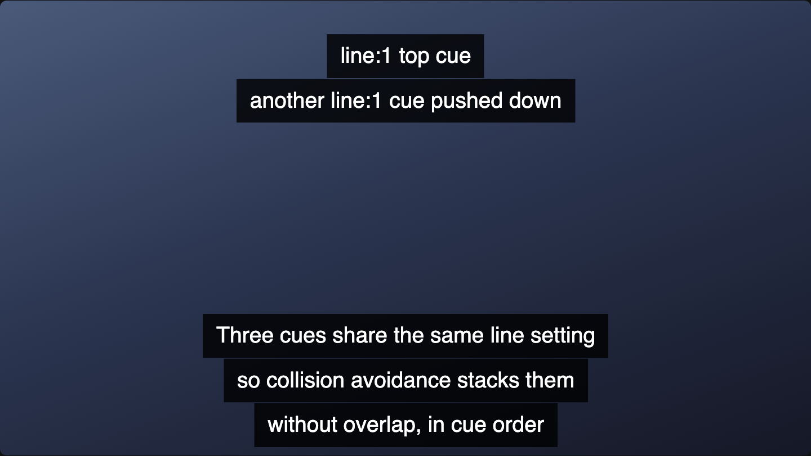
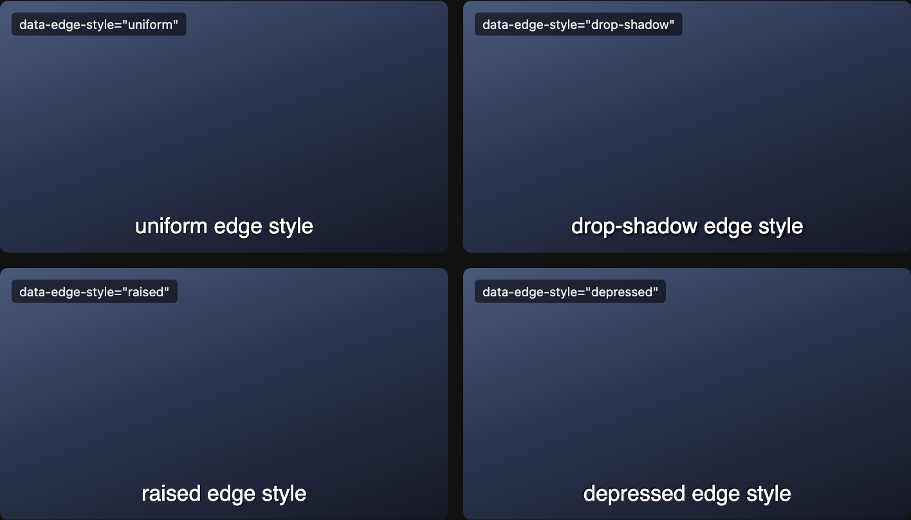
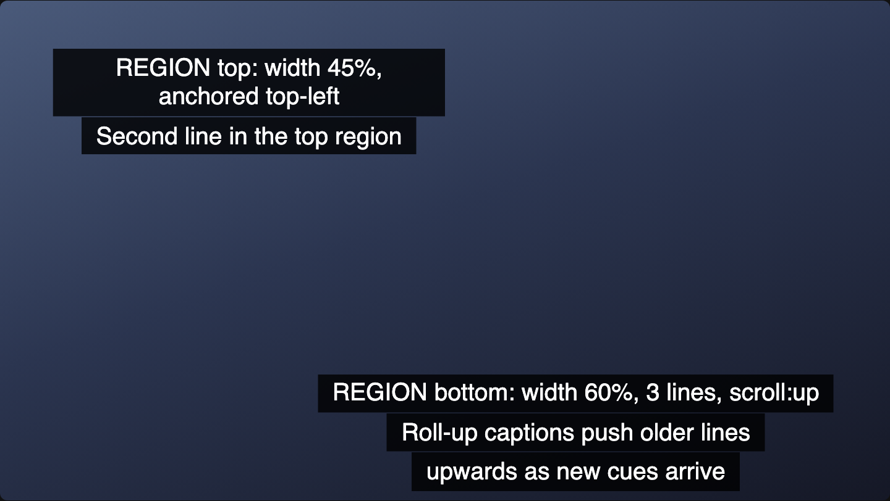
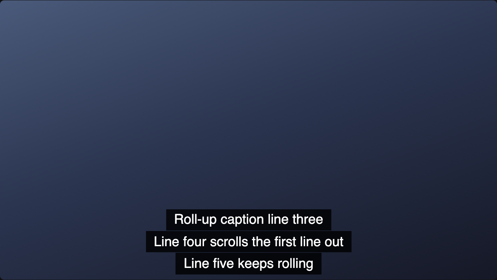
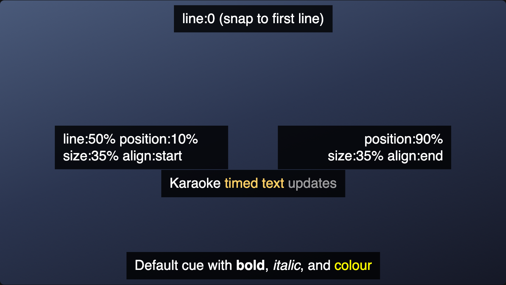
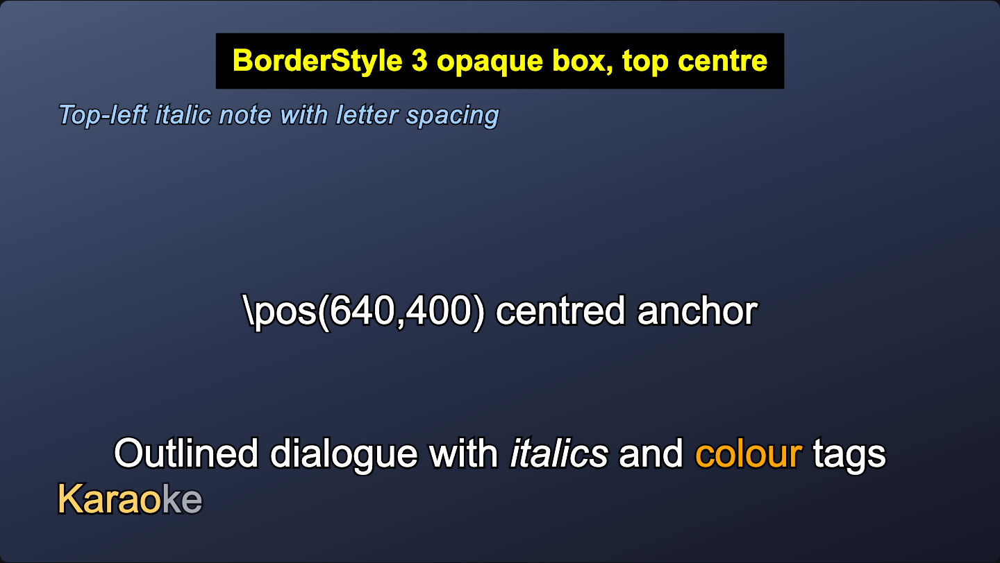

# Media Captions

[![package-badge]][package]
[![discord-badge]][discord]

Captions parsing and rendering library built for the modern web.

**Features**

- 🚯 0 dependencies.
- 💪 Built with TypeScript (TS 5 bundle mode ready).
- 🪶 ~13kB core (gzipped) + modular (parser/renderer split) + tree-shaking support.
- 💤 Parsers are lazy loaded on-demand (each format is its own chunk).
- 🚄 Efficiently load and apply styles in parallel via CSS files.
- 🗂️ Supports VTT, SRT, SSA/ASS, TTML/IMSC1/DFXP, SCC, LRC, SBV, SAMI, MicroDVD, CEA-608/708 from
  video streams, and fMP4 `wvtt`/`stpp` tracks.
- ⬆️ Roll-up captions via VTT regions.
- 🧰 Modern `fetch` and `ReadableStream` APIs.
- 📡 Chunked text and response streaming support (including HLS `X-TIMESTAMP-MAP`).
- 📝 WebVTT spec-compliant parsing and rendering (including `STYLE` blocks), verified against
  the web-platform-tests suite, conformance suites, and real-browser layout tests.
- 🎤 Timed text-tracks for karaoke-style captions (VTT, LRC, and ASS `\k` tags).
- 🎞️ Frame-accurate cue timing via `requestVideoFrameCallback`.
- 🛠️ Supports custom captions parser and cue renderer.
- 🔒 Cue text is rendered as DOM nodes, never HTML strings, so untrusted files can not inject
  markup and strict CSP / Trusted Types policies are satisfied.
- 📡 Live-ready: a `CueTrack` with incremental updates, open-ended cues, and eviction feeds the
  renderer from CEA-608/708 stream decoders.
- 🧩 Structured `cue.layout` / `cue.textStyle` model shared by SSA, TTML, and 708, with JSON
  round-tripping for Workers.
- 🧱 Drop-in `<media-captions>` custom element, plus `media-captions/parsers/*` entries.
- 💥 Collision detection to avoid overlapping or out-of-bounds cues.
- 🏗️ Fixed and in-order cue rendering (including on font or overlay size changes).
- 🛑 Adjustable parsing error-tolerance with strict and non-strict modes.
- 🖥️ Works in the browser and server-side (string renderer).
- 🎨 Easy customization via CSS, including FCC edge-style presets.

🔗 **Quicklinks**

- **[Installation](#installation)**
- **[Demo](#demo)**
- **[Motivation](#motivation)**
- **[API](#api)**

## Demo

The StackBlitz link below showcases a simple example of how captions are fetched, parsed, and
rendered over a native video element. We plan on adding more examples for additional captions
formats and scenarios.

[][stackblitz-demo]

## Motivation

❓ **Are native captions not good enough?**

Simply put, no.

- Positioning, styling, and rendering of cues is interpreted differently across browsers (i.e.,
  not consistent).
- Styling customization via pseudo `::cue` selector is inconsistent across browsers and severely
  limited with respect to even basic movement and styles.
- Cues can not be easily or accurately moved which means they'll become hidden when custom controls
  are active.
- Multiple active cues are not rendered in the correct order. This can also occur randomly on font
  and overlay size changes (e.g., entering fullscreen).
- Failure in positioning and customizing styles correctly results in failing accessibility
  guidelines.
- Text tracks cannot be removed in most browsers as there's no native API to do so. Captions need
  to be managed externally and mapped to a generic text track.
- Karaoke-style captions are not supported out of the box in most browsers.
- Only VTT is natively supported by browsers.
- VTT Regions and roll-up captions are not fully supported in all browsers.
- Custom rendering of cues is not supported.
- Large caption files can not be streamed and aborted when no longer required.
- Obviously can not be used server-side.

Did you know closed-captions are governed by the Federal Communications Commission (FCC) under the
Communications and Video Accessibility Act (CVA)? Not providing captions and adequate
customization options on the web for content that was shown on TV doesn't meet guidelines 😱 Filed
law suits have dramatically increased in recent years! See the amazing
[Caption Me If You Can][caption-me-talk] talk at [Demuxed][demuxed] by Dan Sparacio to learn more.

❓ **What about [mozilla/vtt][mozilla-vtt]?**

The library is old, outdated, and unmaintained.

- Not packaged correctly by modern standards using Node exports with ES6, TS types, CJS/ESM,
  and server bundles.
- Doesn't lazy load the parser.
- Doesn't cleanly work server-side out of the box.
- Doesn't split parser and renderer so they can be imported separately when needed.
- Not built with TypeScript so no types are shipped.
- Doesn't support a wide variety features that we support. Including streaming via modern APIs,
  VTT regions, roll-up captions, custom renderers, alternative captions formats (SRT/SSA),
  timed-text and more.
- In-lines all styles which means they can't be loaded in parallel with JS, makes it harder to
  customize, and slower with respect to DOM updates.
- Doesn't include flexible error tolerance settings.
- Doesn't expose styling attrs for selecting nodes such as cues, voice nodes, and timed-text nodes.

## Installation

First, install the NPM package:

```bash
npm i media-captions
```

Next, include styles if you plan on rendering captions using the [`CaptionsRenderer`](#captionsrenderer):

```js
import 'media-captions/styles/captions.css';
// Optional - include if rendering VTT regions.
import 'media-captions/styles/regions.css';
```

Optionally, you can load the styles directly from a CDN using [JSDelivr](https://www.jsdelivr.com)
like so:

```html
<link rel="stylesheet" href="https://cdn.jsdelivr.net/npm/media-captions/styles/captions.min.css" />
<!-- Optional - include if rendering VTT regions. -->
<link rel="stylesheet" href="https://cdn.jsdelivr.net/npm/media-captions/styles/regions.min.css" />
```

## API

- **Parsing**
  - [Parse Options](#parse-options)
  - [Parse Result](#parse-result)
  - [Parse Errors](#parse-errors)
  - [`parseText`](#parsetext)
  - [`parseTextStream`](#parsetextstream)
  - [`parseResponse`](#parseresponse)
  - [`parseByteStream`](#parsebytestream)
  - [`inferCaptionsFormat`](#infercaptionsformat)
  - [`CaptionsParser`](#captionsparser)
- **Rendering**
  - [`createVTTCueTemplate`](#createvttcuetemplate)
  - [`renderVTTCueString`](#rendervttcuestring)
  - [`tokenizeVTTCue`](#tokenizevttcue)
  - [`renderVTTTokensString`](#rendervtttokensstring)
  - [`updateTimedVTTCueNodes`](#updatetimedvttcuenodes)
  - [`CaptionsRenderer`](#captionsrenderer)
  - [`CueTrack`](#cuetrack)
  - [`<media-captions>`](#media-captions)
  - [`syncCaptionsRenderer`](#synccaptionsrenderer)
  - [`loadEmbeddedFonts`](#loadembeddedfonts)
  - [Styling](#styling)
- **Formats**
  - [VTT](#vtt)
  - [SRT](#srt)
  - [SSA/ASS](#ssaass)
  - [TTML](#ttml)
  - [SCC (CEA-608)](#scc-cea-608)
  - [CEA-608/708 from video streams](#cea-608708-from-video-streams)
  - [LRC](#lrc)
  - [SBV](#sbv)
  - [SAMI](#sami)
  - [MicroDVD](#microdvd)
- [Streaming](#streaming)
- [HLS Segments](#hls-segments)
- [fMP4 subtitle tracks](#fmp4-subtitle-tracks)
- [Player integration (hls.js)](#player-integration-hlsjs)
- [Types](#types)

## Parse Options

All parsing functions exported from this package accept the following options:

- `strict`: Whether strict mode is enabled. In strict mode parsing errors will throw and cancel
  the parsing process, and the WebVTT grammar is enforced exactly (signature, timestamp digits,
  `%` on percentages). Outside strict mode the parser is deliberately tolerant of common real-world
  deviations (missing signature, comma millisecond separators, bare percentages, legacy
  `align:middle`) while still reporting them as errors when `errors` is enabled.
- `errors`: Whether errors should be collected and reported in the final
  [parser result](#parse-result). By default, this value will be true in dev mode or if `strict`
  mode is true. If set to true and `strict` mode is false, the `onError` callback will be invoked.
  Do note, setting this to true will dynamically load error builders which will slightly increase
  bundle size (~1kB).
- `type`: The type of the captions file format so the correct parser is loaded. Options
  include `vtt`, `srt`, `ssa`, `ass`, `ttml` (also `dfxp`/`xml`), `scc`, `lrc`, `sbv`, or a
  custom [`CaptionsParser`](#captionsparser) object.
- `channel`: CEA-608 data channel to decode for SCC files (`1` or `2`).
- `onHeaderMetadata`: Callback that is invoked when the metadata from the header block has been
  parsed.
- `onStyle`: Invoked with the CSS text of each WebVTT `STYLE` block.
- `onCue`: Invoked when parsing a VTT cue block has finished parsing and a `VTTCue` has
  been created. Do note, regardless of which captions file format is provided a `VTTCue` will
  be created.
- `onRegion`: Invoked when parsing a VTT region block has finished and a `VTTRegion` has been
  created.
- `onError`: Invoked when a loading or parser error is encountered. Do note, this is only invoked
  in development, if the `strict` parsing option is true, or if the `errors` parsing option is
  true.

Options can be provided to any parsing function like so:

```ts
import { parseText } from 'media-captions';

parseText('...', {
  strict: false,
  type: 'vtt',
  onCue(cue) {
    // ...
  },
  onError(error) {
    // ...
  },
});
```

## Parse Result

All parsing functions exported from this package return a `Promise` which will resolve a
`ParsedCaptionsResult` object with the following properties:

- `metadata`: An object containing all metadata that was parsed from the header block.
- `regions`: An array containing `VTTRegion` objects that were parsed and created during the
  parsing process.
- `cues`: An array containing `VTTCue` objects that were parsed and created during the parsing
  process.
- `errors`: An array containing `ParseError` objects. Do note, errors will only be collected if
  in development mode, if `strict` parsing option is set to true, or the `errors` parsing option is
  set to true.
- `fonts`: Fonts embedded in the file (SSA/ASS `[Fonts]` section), see
  [`loadEmbeddedFonts`](#loadembeddedfonts).
- `styles`: CSS text from WebVTT `STYLE` blocks, applied by the renderer (see
  [Styling](#styling)).

```ts
import { parseText } from 'media-captions';

// `ParsedCaptionsResult`
const { metadata, regions, cues, errors } = await parseText('...');

for (const cue of cues) {
  // ...
}
```

## Parse Errors

By default, parsing is error tolerant and will always try to recover. You can set strict mode
to ensure errors are not tolerated and are instead thrown. The text stream and parsing process
will also be cancelled.

```ts
import { parseText, type ParseError } from 'media-captions';

try {
  // Any error will now throw and cancel parsing.
  await parseText('...', { strict: true });
} catch (error: ParseError) {
  console.log(error.code, error.message, error.line);
}
```

A more tolerant error collection option is to set the `errors` parsing option to true. This
will ensure the `onError` callback is invoked and also errors are reported in the final
result (this will add ~1kB to the bundle size):

```ts
import { parseText } from 'media-captions';

const { errors } = await parseText('...', {
  errors: true, // Not required if you only want errors in dev mode.
  onError(error) {
    error; // `ParseError`
  },
});

for (const error of errors) {
  // ...
}
```

The `ParseError` contains a numeric error `code` that matches the following values:

```ts
const ParseErrorCode = {
  LoadFail: 0,
  BadSignature: 1,
  BadTimestamp: 2,
  BadSettingValue: 3,
  BadFormat: 4,
  UnknownSetting: 5,
};
```

The `ParseErrorCode` object can be imported from the package.

## `parseText`

This function accepts a text string as input to be parsed:

```ts
import { parseText } from 'media-captions';

const { cues } = await parseText('...');
```

## `parseTextStream`

This function accepts a text stream [`ReadableStream<string>`](https://developer.mozilla.org/en-US/docs/Web/API/ReadableStream) as input to be parsed:

```ts
import { parseTextStream } from 'media-captions';

const stream = new ReadableStream<string>({
  start(controller) {
    controller.enqueue('...');
    controller.enqueue('...');
    controller.enqueue('...');
    // ...
    controller.close();
  },
});

// `ParsedCaptionsResult`
const result = await parseTextStream(stream, {
  onCue(cue) {
    // ...
  },
});
```

## `parseResponse`

The `parseResponse` function accepts a [`Response`](https://developer.mozilla.org/en-US/docs/Web/API/Response) or `Promise<Response>` object. It can be seamlessly used with
[`fetch`](https://developer.mozilla.org/en-US/docs/Web/API/Fetch_API) to parse a response body stream like so:

```ts
import { ParseErrorCode, parseResponse } from 'media-captions';

// `ParsedCaptionsResult`
const result = await parseResponse(fetch('/media/subs/english.vtt'), {
  onCue(cue) {
    // ...
  },
  onError(error) {
    if (error.code === ParseErrorCode.LoadFail) {
      console.log(error.message);
    }
  },
});
```

Every parser is also published as an explicit entry (`media-captions/parsers/vtt`, `srt`, `ssa`,
`ttml`, `scc`, `lrc`, `sbv`) for bundlers or runtimes that can not follow dynamic imports; pass the
default export as `type`.

The captions type is inferred from the response `content-type` header (e.g., `text/vtt`,
`application/x-subrip`, `application/ttml+xml`) and falls back to the URL file extension for
generic types like `text/plain`. You can specify the specific captions format like so:

```ts
parseResponse(..., { type: 'vtt' });
```

The text encoding will be inferred from the response header and forwarded to the underlying
[`TextDecoder`](https://developer.mozilla.org/en-US/docs/Web/API/TextDecoder/TextDecoder). You
can specify a specific encoding like so:

```ts
parseResponse(..., { encoding: 'utf8' });
```

## `parseByteStream`

This function is used to parse byte streams `ReadableStream<Uint8Array>`. It's used by the
`parseResponse` function to parse response body streams. It can be used like so:

```ts
import { parseByteStream } from 'media-captions';

const byteStream = new ReadableStream<Uint8Array>({
  // ...
});

const result = await parseByteStream(byteStream, {
  encoding: 'utf8',
  onCue(cue) {
    // ...
  },
});
```

## `inferCaptionsFormat`

Returns the captions format for a `content-type` header value and optional URL, or `undefined`
when it can not be determined. This is what [`parseResponse`](#parseresponse) uses internally.

```ts
import { inferCaptionsFormat } from 'media-captions';

inferCaptionsFormat('application/ttml+xml'); // 'ttml'
inferCaptionsFormat('text/plain', '/subs/en.srt?token=1'); // 'srt'
```

## `CaptionsParser`

You can create a custom caption parser and provide it to the `type` option on any parse function.
The parser can be created and provided like so:

```ts
import {
  type CaptionsParser,
  type CaptionsParserInit,
  type ParsedCaptionsResult,
} from 'media-captions';

class CustomCaptionsParser implements CaptionsParser {
  /**
   * Called when initializing the parser before the
   * parsing process begins.
   */
  init(init: CaptionsParserInit): void | Promise<void> {
    // ...
  }
  /**
   * Called when a new line of text has been read and
   * requires parsing. This includes empty lines which
   * can be used to separate caption blocks.
   */
  parse(line: string, lineCount: number): void {
    // ...
  }
  /**
   * Called when parsing has been cancelled, or has
   * naturally ended as there are no more lines of
   * text to be parsed.
   */
  done(cancelled: boolean): ParsedCaptionsResult {
    // ...
  }
}

// Custom parser can be provided to any parse function.
parseText('...', {
  type: () => new CustomCaptionsParser(),
});
```

## `createVTTCueTemplate`

This function takes a `VTTCue` and renders the cue text string into a HTML template element
and returns a `VTTCueTemplate`. The template can be used to efficiently store and clone
the rendered cue HTML like so:

```ts
import { createVTTCueTemplate, VTTCue } from 'media-captions';

const cue = new VTTCue(0, 10, '<v Joe>Hello world!');
const template = createVTTCueTemplate(cue);

template.cue; // original `VTTCue`
template.content; // `DocumentFragment`

// <span title="Joe" data-part="voice">Hello world!</span>
const cueHTML = template.content.cloneNode(true);
```

## `renderVTTCueString`

This function takes a `VTTCue` and renders the cue text string into a HTML string. All text and
attribute values are escaped, so the result is safe to assign to `innerHTML` even when the cue
came from an untrusted captions file. Class names are restricted to `[A-Za-z0-9_-]`. This
function can be used server-side to render cue content like so:

```ts
import { renderVTTCueString, VTTCue } from 'media-captions';

const cue = new VTTCue(0, 10, '<v Joe>Hello world!');

// Output: <span title="Joe" data-part="voice">Hello world!</span>
const content = renderVTTCueString(cue);
```

The second argument accepts the current playback time to add the correct `data-past` and
`data-future` attributes to timed text (i.e., karaoke-style captions):

```ts
const cue = new VTTCue(0, 320, 'Hello my name is <5:20>Joe!');

// Output: Hello my name is <span data-part="timed" data-time="80" data-future>Joe!</span>
renderVTTCueString(cue, 310);

// Output: Hello my name is <span data-part="timed" data-time="80" data-past>Joe!</span>
renderVTTCueString(cue, 321);
```

## `tokenizeVTTCue`

This function takes a `VTTCue` and returns a collection of VTT tokens based on the cue
text. Tokens represent the render nodes for a cue:

```ts
import { tokenizeVTTCue, VTTCue } from 'media-captions';

const cue = new VTTCue(0, 10, '<b.foo.bar><v Joe>Hello world!');

const tokens = tokenizeVTTCue(cue);

// `tokens` output:
[
  {
    tagName: 'b',
    type: 'b',
    class: 'foo bar',
    children: [
      {
        tagName: 'span',
        type: 'v',
        voice: 'Joe',
        children: [{ type: 'text', data: 'Hello world!' }],
      },
    ],
  },
];
```

Nodes can be a `VTTBlockNode` which can have children (i.e., class, italic, bold, underline,
ruby, ruby text, voice, lang, timestamp) or a `VTTLeafNode` (i.e., text nodes). Text data and
annotations are entity-decoded (decimal and hex references plus the Latin-1 subset of named
references, including legacy forms without `;`), so escape them yourself if you render to HTML.
For the complete HTML table (2,125 names, about 12 kB gzipped) register the optional entry once:

````ts
import { registerFullHTMLEntities } from 'media-captions/entities';
registerFullHTMLEntities();
``` Unknown or mismatched end tags are ignored and never corrupt nesting. As an
extension, `<c.#rrggbb>` and `<c.bg_#rrggbb>` classes are treated as colours so other formats can
carry arbitrary colours through cue text. The tokens can be used for custom rendering like so:

```ts
function renderTokens(tokens: VTTNode[]) {
  for (const token of tokens) {
    if (token.type === 'text') {
      // Process text nodes here...
      token.data;
    } else {
      // Process block nodes here...
      token.tagName;
      token.class;
      token.type === 'v' && token.voice;
      token.type === 'lang' && token.lang;
      token.type === 'timestamp' && token.time;
      token.color;
      token.bgColor;
      renderTokens(tokens.children);
    }
  }
}
````

All token types are listed below for use in TypeScript:

```ts
import type {
  VTTBlock,
  VTTBlockNode,
  VTTBlockType,
  VTTBoldNode,
  VTTClassNode,
  VTTextNode,
  VTTItalicNode,
  VTTLangNode,
  VTTLeafNode,
  VTTNode,
  VTTRubyNode,
  VTTRubyTextNode,
  VTTTimestampNode,
  VTTUnderlineNode,
  VTTVoiceNode,
} from 'media-captions';
```

## `renderVTTTokensString`

This function takes an array of `VTToken` objects and renders them into a string:

```ts
import { renderVTTTokensString, tokenizeVTTCue, VTTCue } from 'media-captions';

const cue = new VTTCue(0, 10, '<v Joe>Hello world!');
const tokens = tokenizeVTTCue(cue);

// Output: <span title="Joe" data-part="voice">Hello world!</span>
const result = renderVTTTokensString(tokens);
```

## `updateTimedVTTCueNodes`

This function accepts a root DOM node to update all timed text nodes by setting the correct
`data-future` and `data-past` attributes.

```ts
import { updateTimedVTTCueNodes } from 'media-captions';

const video = document.querySelector('video')!,
  captions = document.querySelector('#captions')!;

video.addEventListener('timeupdate', () => {
  updateTimedVTTCueNodes(captions, video.currentTime);
});
```

This can be used when working with karaoke-style captions:

```ts
const cue = new VTTCue(300, 308, '<05:00>Timed...<05:05>Text!');

// Timed text nodes that would be updated at 303 seconds:
// <span data-part="timed" data-time="300" data-past>Timed...</span>
// <span data-part="timed" data-time="305" data-future>Text!</span>
```

## `CaptionsRenderer`

The captions overlay renderer is used to render captions over a video player. It follows the
[WebVTT rendering specification](https://www.w3.org/TR/webvtt1/#rendering) on how regions
and cues should be visually rendered. It includes:

- Correctly aligning and positioning regions and cues.
- Processing and applying all region and cue settings.
- Rendering captions top-down in-order (Cue 1, Cue 2, Cue 3).
- Rendering roll up captions in regions.
- Collision detection to avoid overlapping cues.
- Updating timed text nodes with `data-past` and `data-future` attributes.
- Updating when the overlay is resized.
- Applying SSA/ASS styles and layers (z-order).
- Setting the overlay `lang` attribute from the track `Language` header.
- Finding active cues in O(log n) using a sorted index, so large tracks stay cheap.
- Rendering in three phases (measure, pure layout, write) so a render forces at most two layouts.
- Dispatching `enter`/`exit` events on cues and optionally announcing them to screen readers.
- Accepts native `VTTCue` objects.

> **Warning**
> The [styles files](#installation) need to be included for the overlay renderer to work correctly!



```html
<div>
  <video src="..."></video>
  <div id="captions"></div>
</div>
```

```ts
import 'media-captions/styles/captions.css';
import 'media-captions/styles/regions.css';

import { CaptionsRenderer, parseResponse } from 'media-captions';

const video = document.querySelector('video')!,
  captions = document.querySelector('#captions')!,
  renderer = new CaptionsRenderer(captions);

parseResponse(fetch('/media/subs/english.vtt')).then((result) => {
  renderer.changeTrack(result);
});

// Or use `syncCaptionsRenderer(renderer, video)` for frame-accurate updates.
video.addEventListener('timeupdate', () => {
  renderer.currentTime = video.currentTime;
});
```

**Init options**

- `dir`: Text direction (`ltr` or `rtl`).
- `retention`: Seconds to keep ended cues before evicting them from the track (for live streams).
- `announce`: `true` / `'polite'` / `'assertive'` adds a visually hidden `aria-live` region after
  the overlay that receives the plain text of cues as they appear. The visual overlay itself stays
  `aria-live="off"` because sighted users read it and the audio already carries the words.
- `stacking`: how simultaneous cues stack. `'reading-order'` (default) keeps the newest cue in the
  default slot so lines read top-down in cue order; `'spec'` follows the WebVTT rule (and SSA
  `Collisions: Normal`) where the earliest cue keeps its slot. A track's `Collisions` metadata
  selects this automatically when the option is omitted.
- `lineStep`: `'line-height'` (spec) or `'box'`, which snaps lines by the padded cue box height so
  stacked lines never overlap.
- `safeArea`: inset from the overlay edges in percent (broadcast title-safe is about 10).
- `reducedMotion`: `true`, `false`, or `'auto'` (default, follows `prefers-reduced-motion`). When
  on, cue animations hold their final state and transitions are disabled. Also a live property.

**Props**

- `dir`: Sets the text direction (i.e., `ltr` or `rtl`).
- `currentTime`: Updates the current playback time and schedules a re-render.
- `activeCues`: The cues currently displayed, in render order (read-only).
- `track`: The [`CueTrack`](#cuetrack) being rendered. Add, update, or remove cues on it for live
  content.

**Methods**

- `changeTrack(track: CaptionsRendererTrack)`: Resets the renderer and prepares new regions and
  cues. Pass the parse result directly; its `metadata.Language` is applied as the overlay `lang`
  and its `styles` (WebVTT `STYLE` blocks) are injected scoped to the overlay. `cues` may also be a
  `CueTrack` to follow.
- `attachTrack(track: CueTrack)`: Renders from an existing track and follows its changes.
- `addCue(cue: VTTCue)`: Add a new cue to the renderer.
- `removeCue(cue: VTTCue)`: Remove a cue from the renderer.
- `update(forceUpdate: boolean)`: Schedules a re-render to happen.
- `reset()`: Reset the renderer and clear all internal state including region and cue DOM nodes.
- `destroy()`: Reset the renderer and destroy internal observers and event listeners.

**Cue events**

Every cue dispatches `enter` when it starts showing and `exit` when it stops, matching the native
`TextTrackCue` events, so analytics or custom effects can hook individual cues:

```ts
cue.addEventListener('enter', () => console.log('showing', cue.text));
```

## `CueTrack`

A sorted, incrementally maintained list of cues with O(log n) active-cue lookup, change events,
mutable end times, and eviction. The renderer uses one internally; use it directly for live
content where cues arrive continuously and end times are only known later:

```ts
import { CaptionsRenderer, CueTrack } from 'media-captions';
import { CEA708Decoder } from 'media-captions/cea';

const track = new CueTrack(undefined, { retention: 30 }),
  renderer = new CaptionsRenderer(overlay, { retention: 30 });

renderer.changeTrack({ cues: track });

const decoder = new CEA708Decoder({
  live: true,
  onCue: (cue) => track.add(cue), // endTime is Infinity while the caption is on screen
  onCueUpdate: (cue) => track.update(cue), // end time is now known; re-indexed in place
});
```

- Open-ended cues use `endTime = Infinity`. This works on top of the native `VTTCue` too (a finite
  sentinel is stored internally), and serialises as `null` in JSON.
- `add(cue)`, `addAll(cues)`, `remove(cue)`, `update(cue)`, `clear()`, `has(cue)`, `size`, `cues`.
- `activeAt(time)`: cues active at a time, in start order.
- `evict(time)`: drops cues that ended more than `retention` seconds ago; `maxCues` caps the total.
- `dedupe: true` ignores cues that duplicate an existing one (same times, id, and text), which HLS
  and DASH segments produce whenever a cue straddles a segment boundary or a segment is re-fetched.
- `on(listener)`: subscribe to `add`, `remove`, `update`, and `clear` events; returns an unsubscribe.

## `<media-captions>`

A framework-agnostic custom element that loads, syncs, and renders captions over a media element:

```html
<link rel="stylesheet" href="https://cdn.jsdelivr.net/npm/media-captions/styles/captions.css" />

<div style="position: relative">
  <video id="video" src="movie.mp4"></video>
  <media-captions for="video" src="/subs/english.vtt" edge-style="uniform"></media-captions>
</div>

<script type="module">
  import { defineMediaCaptionsElement } from 'media-captions/element';

  defineMediaCaptionsElement();
</script>
```

- Attributes: `src`, `type` (format, inferred when omitted), `for` (media element id) or the
  `media` property, `dir`, `edge-style`, `frame-accurate` (`"false"` for event-driven sync), and
  `shadow` to render in a shadow root with stylesheets from the `styles` attribute (defaults to
  the jsDelivr CSS). In light DOM (the default) the page includes the stylesheets itself.
- Properties/methods: `renderer`, `track`, `load(result)`, `clear()`, `destroy()`.
- Events: `load` (detail: parse result), `error` (detail: `Error` or `ParseError[]`), and
  `cuechange` (detail: `{ activeCues }`).
- Importing the module has no side effects, so it is safe to import during server rendering.

## `syncCaptionsRenderer`

The media `timeupdate` event only fires a few times per second, which makes short cues and
karaoke timed text visibly late. This helper drives a [`CaptionsRenderer`](#captionsrenderer)
from `requestVideoFrameCallback` while playing (falling back to `requestAnimationFrame`) and
only relies on events while paused or seeking. It returns a function that stops syncing.

```ts
import { CaptionsRenderer, syncCaptionsRenderer } from 'media-captions';

const renderer = new CaptionsRenderer(captions),
  stop = syncCaptionsRenderer(renderer, video);

// Later...
stop();
```

For a low-power, event-driven mode, mirror the cues into a hidden native text track (our `VTTCue`
extends the native class) and let the browser fire `cuechange` exactly at cue boundaries:

```ts
const track = video.addTextTrack('metadata');
for (const cue of cues) track.addCue(cue);

syncCaptionsRenderer(renderer, video, { frameAccurate: false, track });
```

## `loadEmbeddedFonts`

SSA/ASS files can embed fonts in a `[Fonts]` section. The parser decodes them into the `fonts`
array on the parse result, and this helper registers them with the document using the
`FontFace` API so styled cues render with the intended typeface.

```ts
import { loadEmbeddedFonts, parseResponse } from 'media-captions';

const result = await parseResponse(fetch('/subs/english.ass'));
const faces = await loadEmbeddedFonts(result.fonts ?? []);

// Remove them later if needed.
for (const face of faces) document.fonts.delete(face);
```

## Styling

Captions rendered with the [`CaptionOverlayRenderer`](#captionsoverlayrenderer) can be
easily customized with CSS. Here are all the parts you can select and customize:

```css
/* `#captions` assumes you set the id on the captions overlay element. */
#captions {
  /* simple CSS vars customization (defaults below) */
  --overlay-padding: 1%;
  --cue-color: white;
  --cue-bg-color: rgba(0, 0, 0, 0.8);
  --cue-font-size: 5cqh; /* 5% of the overlay height via container query units */
  --cue-line-height: calc(var(--cue-font-size) * 1.2);
  --cue-padding-x: calc(var(--cue-font-size) * 0.6);
  --cue-padding-y: calc(var(--cue-font-size) * 0.4);
  --cue-edge-color: black;
  /* uniform outline drawn with `paint-order: stroke fill` (cheaper and cleaner than shadows) */
  --cue-text-stroke: 0.08em black;
  --cue-text-shadow: none;
}

#captions [data-part='region'] {
}

#captions [data-part='region'][data-active] {
}

#captions [data-part='region'][data-scroll='up'] {
}

#captions [data-part='cue-display'] {
}

#captions [data-part='cue'] {
}

#captions [data-part='cue'][data-id='...'] {
}

#captions [data-part='voice'] {
}

#captions [data-part='voice'][title='Joe'] {
}

#captions [data-part='timed'] {
}

#captions [data-part='timed'][data-past] {
}

#captions [data-part='timed'][data-future] {
}
```

Every part also exposes a matching `part` attribute, so the overlay can be styled from outside a
shadow root with `::part(cue)`, `::part(region)`, and so on.

### WebVTT `STYLE` blocks

`STYLE` blocks in a VTT file are parsed into `result.styles` and applied by
[`CaptionsRenderer`](#captionsrenderer). Selectors are rewritten to the rendered DOM and scoped
to the overlay, so several renderers on one page never leak styles into each other:

```text
WEBVTT

STYLE
::cue { color: papayawhip; }
::cue(b) { color: peachpuff; }
::cue(v[voice="Bob"]) { color: lime; }
::cue(:past) { color: gray; }
::cue-region(#top) { opacity: 0.8; }
```

Declarations are restricted to presentational properties (colour, background, font, text
decoration and shadow, outline, opacity, visibility, and similar) and anything that would load an
external resource such as `url()` or `@import` is dropped, so untrusted files can style captions
but never the page. `transformVTTStyle(css, scope)` is exported if you want to apply the same
rewriting yourself.

### Cue layout and text style model

Formats with absolute positioning (SSA/ASS, TTML, CEA-708) express placement and styling through
two structured fields on the cue rather than CSS strings, so custom renderers can read them
directly and cues survive `structuredClone` / `postMessage`:

```ts
cue.layout = {
  left: 50, // percentages of the overlay
  bottom: 5,
  width: 'max-content', // or 'auto' or a percentage
  maxWidth: 90,
  translate: { x: -0.5 }, // fraction of the cue box; centres the box on `left`
  fixed: false, // true: never moved by collision avoidance (SSA \pos)
};

cue.textStyle = {
  color: 'rgba(255,255,255,1)',
  fontSize: 'calc(var(--overlay-height) * 0.0667)',
  textStroke: '2px black', // painted behind the glyphs
  textAlign: 'center',
};

cue.style = { '--cue-padding-x': '0' }; // raw CSS escape hatch, applied last

// Per-run typography: cue text references `cue.spans` with <c.s-KEY>.
cue.text = 'Normal <c.s-big>bigger</c> and a <c.s-shape></c>';
cue.spans = {
  big: { fontSize: '1.5em', textStroke: '2px black' },
  shape: { drawing: { path: 'M0 0 L10 0 L10 10 Z', viewBox: [0, 0, 10, 10], width: 5, height: 8 } },
};

// Media-synchronised animations (Web Animations API driven from currentTime, so they scrub and
// pause with the video). Times are seconds relative to the cue start.
cue.animations = [
  { duration: 0.5, keyframes: [{ opacity: 0 }, { opacity: 1 }] }, // fade in
  {
    target: { span: 'big' },
    delay: 1,
    duration: 2,
    keyframes: [{ color: 'white' }, { color: 'red' }],
  },
];

JSON.stringify(cue); // plain object, region referenced by id
VTTCue.from(JSON.parse(json), regions); // rebuilds the cue
```

The stylesheet defaults live in `@layer media-captions`, so any unlayered author rule overrides
them regardless of specificity or order, and the colour and overlay size variables are registered
with `@property` so they are typed, have fallbacks, and can be transitioned.

Cue text uses `text-wrap: balance`, which is what the WebVTT rendering rules ask for and which
browsers now support natively, and region (roll-up) cues use `text-wrap: stable` so earlier lines
never reflow. Japanese cues get `word-break: auto-phrase`.

### Caption settings presets

Players are expected to offer viewer controls for caption appearance. Set these attributes on the
overlay element (or the `<media-captions>` element's overlay via `renderer.overlay`):

| Attribute             | Values                                       |
| --------------------- | -------------------------------------------- |
| `data-text-size`      | `small`, `medium`, `large`, `x-large`        |
| `data-contrast`       | `high`                                       |
| `data-background`     | `none`, `translucent`, `opaque`              |
| `data-font`           | `sans`, `serif`, `mono`, `casual`            |
| `data-edge-style`     | see below                                    |
| `data-reduced-motion` | set by the renderer's `reducedMotion` option |

### Edge Styles

FCC/CVAA guidelines require user-selectable character edge styles. Set `data-edge-style` on the
overlay element to `uniform`, `drop-shadow`, `raised`, `depressed`, or `none`, and customize the
colour with `--cue-edge-color`:

```html
<div id="captions" data-edge-style="uniform"></div>
```



## VTT

Web Video Text Tracks (WebVTT) is the natively supported captions format supported
by browsers. You can learn more about it on
[MDN](https://developer.mozilla.org/en-US/docs/Web/API/WebVTT_API) or by reading the
[W3 specification](https://www.w3.org/TR/webvtt1).

WebVTT is a plain-text file that looks something like this:

```text
WEBVTT
Kind: Language
Language: en-US

REGION id:foo width:100 lines:3 viewportanchor:0%,0% regionanchor:0%,0% scroll:up

1
00:00 --> 00:02 region:foo
Hello, Joe!

2
00:02 --> 00:04 region:foo
Hello, Jane!
```

```ts
parseResponse(fetch('/subs/english.vtt'), { type: 'vtt' });
```

> **Warning**
> The parser will throw in strict parsing mode if the WEBVTT header line is not present.

### VTT Regions

WebVTT supports regions for bounding/positioning cues and implementing roll up captions
by setting `scroll:up`.





### VTT Cues

WebVTT cues are used for positioning and displaying text. They can snap to lines or be
freely positioned as a percentage of the viewport.

```ts
const cue = new VTTCue(0, 10, '...');

// Position at line 5 in the video.
// Lines are calculated using cue line height.
cue.line = 5;

// 50% from the top and 10% from the left of the video.
cue.snapToLines = false;
cue.line = 50;
cue.position = 10;

// Align cue horizontally at end of line.
cue.align = 'end';
// Align top of the cue at the bottom of the line.
cue.lineAlign = 'end';
```



## SRT

SubRip Subtitle (SRT) is a simple captions format that only contains cues. There are no
regions as found in [VTT](#vtt), but the parser understands the common extensions:

- `<b>`, `<i>`, `<u>` tags, and `<font color="...">` which maps to a WebVTT colour class (named
  WebVTT colours, hex values, and common HTML colour names).
- `{\anN}` numpad alignment tags left over from ASS conversions (e.g., `{\an8}` for top placement).
- Extended `X1: X2: Y1: Y2:` coordinates on the timing line are ignored instead of rendered.
- `-->` without surrounding whitespace, and `.` or `,` as the milliseconds separator.

SRT is a plain-text file that looks like this:

```text
00:00 --> 00:02,200
Hello, Joe!

00:02,200 --> 00:04,400
Hello, Jane!
```

```ts
parseResponse(fetch('/subs/english.srt'), { type: 'srt' });
```

Note that SRT timestamps use a comma `,` to separate the milliseconds unit unlike VTT which uses
a dot `.`.

## SSA/ASS

SubStation Alpha (SSA) and its successor Advanced SubStation Alpha (ASS) are subtitle formats
commonly used for anime content. They allow for rich text formatting, including
color, font size, bold, italic, and underline, as well as more advanced features like karaoke and
typesetting.

SSA/ASS is a plain-text file that looks like this:

```text
[Styles]
Format: Name, Fontname, Fontsize, PrimaryColour, SecondaryColour, OutlineColour, BackColour, Bold, Italic, Underline, StrikeOut, ScaleX, ScaleY, Spacing, Angle, BorderStyle, Outline, Shadow, Alignment, MarginL, MarginR, MarginV, Encoding
Style: Default,Arial,36,&H00FFFFFF,&H000000FF,&H00000000,&H00000000,0,0,0,0,100,100,0,0,1,2,2,2,10,10,10,1

[Events]
Format: Layer, Start, End, Style, Name, MarginL, MarginR, MarginV, Effect, Text
Dialogue: 0,0:00:05.10,0:00:07.20,Default,,0,0,0,,Hello, world!

[Other Events]
Format: Start, End, Text
Dialogue: 0:00:04,\t0:00:07.20, One!
Dialogue: 0:00:05,\t0:00:08.20, Two!
Dialogue: 0:00:06,\t0:00:09.20, Three!
Continue dialogue on a new line.
```

```ts
parseResponse(fetch('/subs/english.ssa'), { type: 'ssa' });
```



The following features are supported:

- `[Script Info]` (`PlayResX`/`PlayResY`, `WrapStyle`, `ScriptType`) with all sizes, margins,
  outlines, and positions scaled to the play resolution so they track the overlay size.
- Multiple styles blocks and all format fields (colours with alpha, bold/italic/underline/strike,
  scale, spacing, angle, border style, outline, shadow, alignment, margins), including legacy SSA
  v4.00 alignment values.
- Multiple events blocks, `Layer` (rendered as z-order), `Name` (rendered as a voice span), and
  per-dialogue margins.
- Override tags, mapped onto the structured cue model:
  - Formatting: `\i`, `\b`, `\u`, `\s`, `\c`/`\1c`, `\2c`, `\3c`, `\4c`, `\alpha`/`\1a`, `\3a`, `\4a`, `\r` and
    `\rStyle`.
  - Per-run typography via `cue.spans`: `\fs`, `\fn`, `\fsp`, `\fscx`/`\fscy`, `\frx`/`\fry`/`\frz`, `\bord`,
    `\xbord`/`\ybord`, `\shad`, `\xshad`/`\yshad`, `\blur`, `\be`.
  - Placement: `\an`/`\a`, `\pos`, `\move` (media-synced position animation), `\clip` (rectangles
    anywhere, resolved against the final box; drawings on positioned cues as exact polygon clip
    paths), `\q`.
  - Animation: `\fad`, `\fade`, and `\t` (colours, alpha, scale, rotation, border, blur, font size,
    spacing, shadow; acceleration is sampled; chained `\t` blocks compose).
  - Karaoke: `\k` timestamps, `\kf`/`\K` fill sweeps, `\ko` outline highlights.
  - Drawings: `\p` vector drawings (`m n l b s p c`, b-splines converted to cubics) rendered as inline SVG,
    with `\bord` strokes.
- `Effect` events: `Scroll up`/`Scroll down` (clipped band animation) and `Banner`.
- `WrapStyle`, `Collisions` (drives the renderer's stacking mode), `ScaledBorderAndShadow`.
- Embedded fonts in `[Fonts]`, see [`loadEmbeddedFonts`](#loadembeddedfonts).

All animations are Web Animations driven from media time, so they pause, seek, and scrub with the
video rather than running on the wall clock.

The following are approximated or not supported:

- `\iclip`, `\fax`/`\fay` shear, `\org` rotation origin, `\pbo`, `\kt`, `\fe`.
- Vector `\clip` drawings on non-positioned cues (rectangular clips work everywhere; on `\move`
  cues the clip travels with the box).
- Karaoke sweeps use a text-clipped gradient, so strokes and shadows inside the syllable can show
  through.
- Movie, Picture, Sound, and Command events.

For pixel-exact libass parity on heavy typesetting (thousands of animated drawings per frame),
[SubtitlesOctopus](https://github.com/libass/JavascriptSubtitlesOctopus) remains an option. You'll
need to fall back to this implementation on iOS Safari (iPhone) as custom captions are not
supported there.

## TTML

Timed Text Markup Language (TTML) and its profiles IMSC1, DFXP, EBU-TT-D, and SMPTE-TT are XML
based and widely used in broadcast and DASH. The parser is a small tolerant XML tokenizer that
works server-side (no `DOMParser`).

```ts
parseResponse(fetch('/subs/english.ttml'), { type: 'ttml' });
```

Supported: clock and offset time expressions (including frames and ticks), time inheritance
across `body`/`div`/`p`/`span` (with the next paragraph's start used as a missing end), referential
and inline styling, regions (`tts:origin`, `tts:extent`, `tts:displayAlign`, `tts:textAlign`) in
percentages, pixels, or cells (`ttp:cellResolution`) mapped to cue positioning, `tts:fontSize`
mapped to a scaled cue font size, vertical writing modes (`tbrl`, `tblr`), italics, bold,
underline, colours, `xml:lang`, ruby, `<br/>`, `xml:space`, and timed spans mapped to WebVTT
timestamp tags, `<set>` animations on paragraphs, spans, regions, and containers (paragraphs are
split into styled slices), `seq` time containers, span and region timing, `tts:visibility`,
`tts:display`, `tts:opacity`, `tts:position`, `tts:padding`, `tts:lineHeight`, `tts:textOutline`,
`tts:textShadow`, span-level typography and colours (via `cue.spans`), `itts:forcedDisplay` (a
`forced` class plus `HasForcedCues` metadata), SMPTE-TT / IMSC image cues, wall-clock time bases
(made relative to the earliest cue, with `ClockStart` metadata so you can re-offset with
`shiftVTTCues`), and `ttp:dropMode` `dropNTSC` and `dropPAL`. 62 documents from the W3C IMSC test
suite parse under `tests/imsc`. Not supported: `rubyPosition`, `tts:showBackground`, bidi
overrides, and external image URLs (never fetched).

## SCC (CEA-608)

Scenarist Closed Caption (SCC) files carry raw CEA-608 byte pairs with SMPTE timecodes and are the
standard interchange format for broadcast captions in the US.

```text
Scenarist_SCC V1.0

00:00:01:15	9420 9420 94ae 94ae 9452 9452 97a1 97a1 c8e5 ecec ef2e 942f 942f
00:00:03:00	942c 942c
```

```ts
parseResponse(fetch('/subs/english.scc'), { type: 'scc' });
```

The parser decodes pop-on, roll-up, and paint-on captions, including special and extended
characters, colours, italics, underline, and the 15x32 row/column grid which is mapped to cue
`line`/`position`. Drop-frame (`;`) and non-drop timecodes are supported. CC1 is decoded by
default; pass `channel: 2` to decode CC2 instead. SCC files only carry field 1, so CC3/CC4 need
the stream decoders below. Text mode and XDS are not supported.

## CEA-608/708 from video streams

Broadcast and HLS/DASH streams carry captions inside the video as `cc_data` (ATSC A/53 user
data in MPEG-2, or SEI messages in H.264/H.265). Players such as hls.js and mux.js surface these
as byte triplets. Two stream decoders turn them into `VTTCue` objects that the renderer can show
like any other track:

```ts
import { CEA608Decoder, CEA708Decoder, parseCCData } from 'media-captions/cea';

// CEA-608: channels 1/2 are on field 1, channels 3/4 on field 2.
const cc608 = new CEA608Decoder({ channel: 1, onCue: (cue) => renderer.addCue(cue) });

// CEA-708 (DTVCC): pick a service (1 is the primary caption service).
const cc708 = new CEA708Decoder({ service: 1, onCue: (cue) => renderer.addCue(cue) });

// `sei` is the payload of a user_data_registered_itu_t_t35 SEI message starting at "GA94",
// or a raw cc_data() structure. `pts` is the presentation time in seconds.
const triplets = parseCCData(sei);
cc608.decodeCCData(triplets, pts);
cc708.decodeCCData(triplets, pts);

// When the stream ends, close any open cues.
cc608.flush();
cc708.flush();
```

The decoders live in the separate `media-captions/cea` entry so the core bundle stays small.
Both expose `cues` (everything emitted so far), `reset()`, and `flush(endTime?)`. The
608 decoder also accepts raw byte pairs via `decodePair(byte1, byte2, time, field)`, and is the
engine behind the SCC parser. The 708 decoder assembles DTVCC packets and service blocks, models
the eight caption windows with pen attributes (sizes, edges, colours), window fill and borders,
print and scroll directions, display effects (fade and wipe via `cue.textStyle.animation`), and
word wrapping, and maps window anchors to cue `line`/`position`, so positioned captions land where
the broadcaster placed them. Both decoders support `live: true`, which emits open-ended cues and
updates them in place through `onCueUpdate` (see [`CueTrack`](#cuetrack)).

## LRC

LRC is the lyrics format used by music players. Enhanced LRC word timings are mapped to WebVTT
timestamp tags so karaoke styling works out of the box.

```text
[ti:Song Title]
[offset:-200]
[00:12.00]Line one
[00:17.20]<00:17.20>Word <00:17.80>by <00:18.40>word
```

```ts
parseResponse(fetch('/lyrics/song.lrc'), { type: 'lrc' });
```

ID tags are returned as metadata, `offset` is applied, and each cue ends when the next begins.

## SBV

SubViewer (SBV) is the simple format exported by YouTube:

```text
0:00:00.000,0:00:02.000
Hello, Joe!

0:00:02.000,0:00:04.000
Hello, [br]Jane!
```

```ts
parseResponse(fetch('/subs/english.sbv'), { type: 'sbv' });
```

## SAMI

Synchronized Accessible Media Interchange (`.smi`) is the HTML-like format from Windows Media
Player, still common in archives and in Korean subtitle distribution:

```ts
parseResponse(fetch('/subs/movie.smi'), { type: 'smi' });
```

Every language class in the file is emitted. Each cue's `id` is its class name and its text is
wrapped in `<lang xx>` when the class declares a language, so hosts can filter by either;
`metadata.Languages` lists the classes. Unclosed tags, `&nbsp;` clears, `<font color>`, and
out-of-order `SYNC` blocks are handled.

## MicroDVD

Frame-based `.sub` files (`{start}{end}Text|line`). The optional `{1}{1}25.000` header sets the
frame rate (default 23.976, reported as `metadata.FrameRate`). Formatting codes (`{y:i}`,
`{Y:b}`, `{c:$bbggrr}`, `{f:}`, `{s:}`) map to WebVTT tags and span styles; `{P:x,y}` positions map
to a fixed layout on an assumed 640x480 canvas.

```ts
parseResponse(fetch('/subs/movie.sub'), { type: 'sub' });
```

## Streaming

You can split large captions files into chunks and use the [`parseTextStream`](#parsetextstream)
or [`parseResponse`](#parseresponse) functions to read and parse the stream. Files can be chunked
however you like and don't need to be aligned with line breaks.

Here's an example that chunks and streams a large VTT file on the server:

```ts
import fs from 'node:fs';

async function handle() {
  const stream = new ReadableStream({
    start(controller) {
      const encoder = new TextEncoder();
      const stream = fs.createReadStream('english.vtt');
      stream.on('readable', () => {
        controller.enqueue(encoder.encode(stream.read()));
      });
      stream.on('end', () => {
        controller.close();
      });
    },
  });

  return new Response(stream, {
    headers: {
      'Content-Type': 'text/vtt; charset=utf-8',
    },
  });
}
```

## HLS Segments

WebVTT segments served over HLS carry an `X-TIMESTAMP-MAP` header that maps the segment's local
time to the MPEG-TS timeline. The header is preserved in the parse result metadata and can be
applied like so:

```ts
import { parseResponse, parseVTTTimestampMap, shiftVTTCues } from 'media-captions';

const { metadata, cues } = await parseResponse(fetch(segmentURL));
const map = parseVTTTimestampMap(metadata);

if (map) {
  // `initialPTS` is the first video PTS (90kHz) of the stream, as exposed by your HLS client.
  shiftVTTCues(cues, map.offset - initialPTS / 90000);
}
```

## fMP4 subtitle tracks

DASH and modern HLS deliver subtitles as ISOBMFF samples: `wvtt` (WebVTT) or `stpp` (TTML,
including IMSC images). The `media-captions/mp4` entry demuxes init and media segments straight
into cues, so a player does not have to unwrap the boxes itself:

```ts
import { CaptionsRenderer, CueTrack } from 'media-captions';
import { MP4SubtitleDemuxer } from 'media-captions/mp4';

const track = new CueTrack(undefined, { dedupe: true, retention: 60 }),
  renderer = new CaptionsRenderer(overlay);
renderer.changeTrack({ cues: track });

const demuxer = new MP4SubtitleDemuxer({ onCue: (cue) => track.add(cue) });
const tracks = demuxer.init(initSegmentBytes); // [{ id, type: 'wvtt' | 'stpp', timescale, language }]
demuxer.push(mediaSegmentBytes, { timeOffset: periodStart });
renderer.changeTrack({ cues: track, regions: demuxer.regions, styles: demuxer.styles });
```

`parseMP4Subtitles(init, segments)` is the one-shot equivalent that returns a normal parse result.

## Player integration (hls.js)

Wiring the pieces together for an HLS player with both WebVTT subtitle segments and embedded
CEA-608/708 captions:

```ts
import Hls from 'hls.js';
import {
  CaptionsRenderer,
  CueTrack,
  parseText,
  parseVTTTimestampMap,
  shiftVTTCues,
  syncCaptionsRenderer,
} from 'media-captions';
import { CEA608Decoder, CEA708Decoder, parseCCData } from 'media-captions/cea';

const track = new CueTrack(undefined, { dedupe: true, retention: 60 }),
  renderer = new CaptionsRenderer(overlay, { retention: 60 });
renderer.changeTrack({ cues: track });
syncCaptionsRenderer(renderer, video);

// Embedded captions: hls.js exposes SEI user data per fragment.
const cc608 = new CEA608Decoder({
    channel: 1,
    live: true,
    onCue: (c) => track.add(c),
    onCueUpdate: (c) => track.update(c),
  }),
  cc708 = new CEA708Decoder({
    service: 1,
    live: true,
    onCue: (c) => track.add(c),
    onCueUpdate: (c) => track.update(c),
  });

hls.on(Hls.Events.FRAG_PARSING_USERDATA, (_, data) => {
  for (const sample of data.samples) {
    const triplets = parseCCData(sample.bytes);
    cc608.decodeCCData(triplets, sample.pts);
    cc708.decodeCCData(triplets, sample.pts);
  }
});

// WebVTT subtitle segments: parse each fragment and align it with X-TIMESTAMP-MAP.
hls.on(Hls.Events.FRAG_LOADED, async (_, data) => {
  if (data.frag.type !== 'subtitle') return;
  const { metadata, cues } = await parseText(new TextDecoder().decode(data.payload));
  const map = parseVTTTimestampMap(metadata);
  if (map) shiftVTTCues(cues, map.offset - hls.initPTS / 90000);
  track.addAll(cues); // dedupe drops the cues repeated across segment boundaries
});
```

Disable hls.js's own subtitle rendering (`renderTextTracksNatively: false`, `enableCEA708Captions: false`)
so cues are not drawn twice.

## Types

Here's the types that are available from this package for use in TypeScript:

```ts
import type {
  CaptionsFileFormat,
  CaptionsParser,
  CaptionsParserInit,
  CaptionsRenderer,
  CaptionsRendererTrack,
  EmbeddedFont,
  ParseByteStreamOptions,
  ParseCaptionsOptions,
  ParsedCaptionsResult,
  ParseError,
  ParseErrorCode,
  ParseErrorInit,
  SyncCaptionsRendererOptions,
  TextCue,
  VTTCue,
  VTTCueTemplate,
  VTTHeaderMetadata,
  VTTRegion,
  VTTTimestampMap,
} from 'media-captions';
```

## Development

```bash
pnpm install
pnpm check           # oxfmt + oxlint via Vite+ (`vp check`)
pnpm typecheck       # tsc
pnpm test            # unit suites (node + jsdom) and real-browser layout suites (Playwright)
pnpm test:unit
pnpm test:browser    # needs `pnpm exec playwright install chromium` once
pnpm build           # vp pack (tsdown + publint + attw) -> dist/prod.js and the cea, element, entities, parsers/* entries
pnpm size            # gzipped size budgets per entry (scripts/size-check.mjs)
pnpm coverage        # unit suites with V8 coverage
pnpm docs            # TypeDoc API reference into docs/api
pnpm playground      # interactive playground at http://localhost:3200/playground/index.html
pnpm sandbox         # interactive scenarios at http://localhost:3100/.sandbox/index.html
pnpm screenshots     # regenerates the README images from the sandbox scenarios
```

The whole toolchain is [Vite+](https://viteplus.dev): Vite, Vitest, Oxlint, Oxfmt, and tsdown are
configured together in `vite.config.ts` (`test`, `lint`, `fmt`, `pack`).

### Playground

`pnpm playground` opens an interactive playground at `http://localhost:3200/playground/index.html`
with a mocked media clock (play, scrub, rate, frame stepping, loop, jump to cue), built-in samples
for every parser plus a synthesised CEA-608/708 live stream, an editable source panel with file
loading, live renderer options (stacking, line step, safe area, announcer, reduced motion, edge
styles, presets, colours, shadow DOM), a debug overlay of layout boxes, an inspector (active cues,
all cues, metadata, errors, events, timeline), a `<media-captions>` element view, and a gallery
that renders every sample at once. Views are shareable via the URL. `playground/README.md` has the
details and `pnpm playground:screenshots` regenerates `playground/screenshots/`.

Sandbox scenarios (used for the README images): `cues`, `regions`, `region-scroll`, `collisions`,
`ssa`, `edge-styles`, `layout` (the cue layout/text style model), `live` (a `CueTrack` fed
incrementally), and `element` (`<media-captions>`).

CI (`.github/workflows/ci.yml`) runs formatting, linting, type-checking, the unit, WPT, IMSC,
corpus, and fuzz suites with coverage, the Chromium layout suites, the build with package checks,
the size budgets, and publishes the API docs as an artifact. `release.yml` publishes to npm with
provenance when a `v*` tag is pushed. Screenshot baselines are per platform, so the visual suite
is excluded in CI until Linux baselines exist; the manual `record-baselines.yml` workflow records
them and opens a pull request.

Parsing is covered by the vendored web-platform-tests WebVTT suites under `tests/wpt` (118
tests; the handful of intentional real-world tolerances are listed in
`tests/wpt/KNOWN_DIVERGENCES.md` and tracked with `test.fails`), by the W3C IMSC test documents
under `tests/imsc`, by hand-written conformance suites under `tests/conformance` (WebVTT file
structure, cue text, SSA/ASS incl. typesetting), and by per-format suites. Rendering is measured in Chromium under
`tests/browser` (stacking, line snapping, percentage lines, position/size/align, vertical text,
RTL, regions, resize, SSA layout, transforms). `tests/browser/visual.test.ts` adds screenshot
comparisons with a small pixel tolerance; baselines live in `tests/browser/__screenshots__` per
browser and platform, so the first run on a new platform records them and later runs compare.

## 📝 License

Media Captions is [MIT licensed](./LICENSE).

[package]: https://www.npmjs.com/package/media-captions
[package-badge]: https://img.shields.io/npm/v/media-captions/next?style=flat-square
[discord]: https://discord.com/invite/7RGU7wvsu9
[discord-badge]: https://img.shields.io/discord/742612686679965696?color=%235865F2&label=%20&logo=discord&logoColor=white&style=flat-square
[stackblitz-demo]: https://stackblitz.com/edit/media-captions?embed=1&file=src/main.ts&hideNavigation=1&showSidebar=1
[demuxed]: https://demuxed.com
[caption-me-talk]: https://www.youtube.com/watch?v=Z0HqYQqdErE
[mozilla-vtt]: https://github.com/mozilla/vtt.js
[vidstack-player]: https://github.com/vidstack/player
